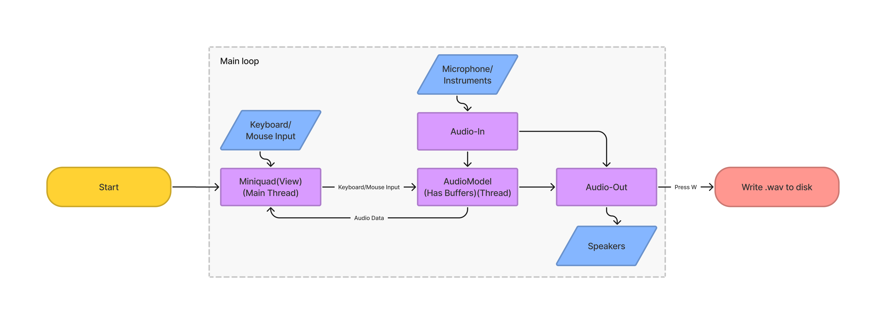
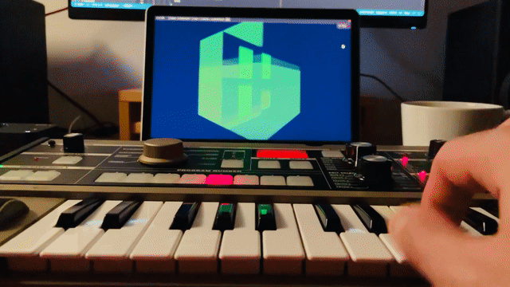

# modul 

A basic audio sampling tool that can record arbitrary number of audio samples for arbitrary number of seconds and loop them infinitely.

Click the gif to watch the video.

### Controls
Controls and shortcuts can also be found in the program in 'Controls' window
- select tape [1-8]
- select secondary tape shift+[1-8]
- record tape toggle (space)
- clear tape (C)
- clear all tapes shift+C
- mute/unmute tape (M)
- record live toggle (T)
- play-through toggle (Y)
- write to disc (W)
- tape volume (up/down)